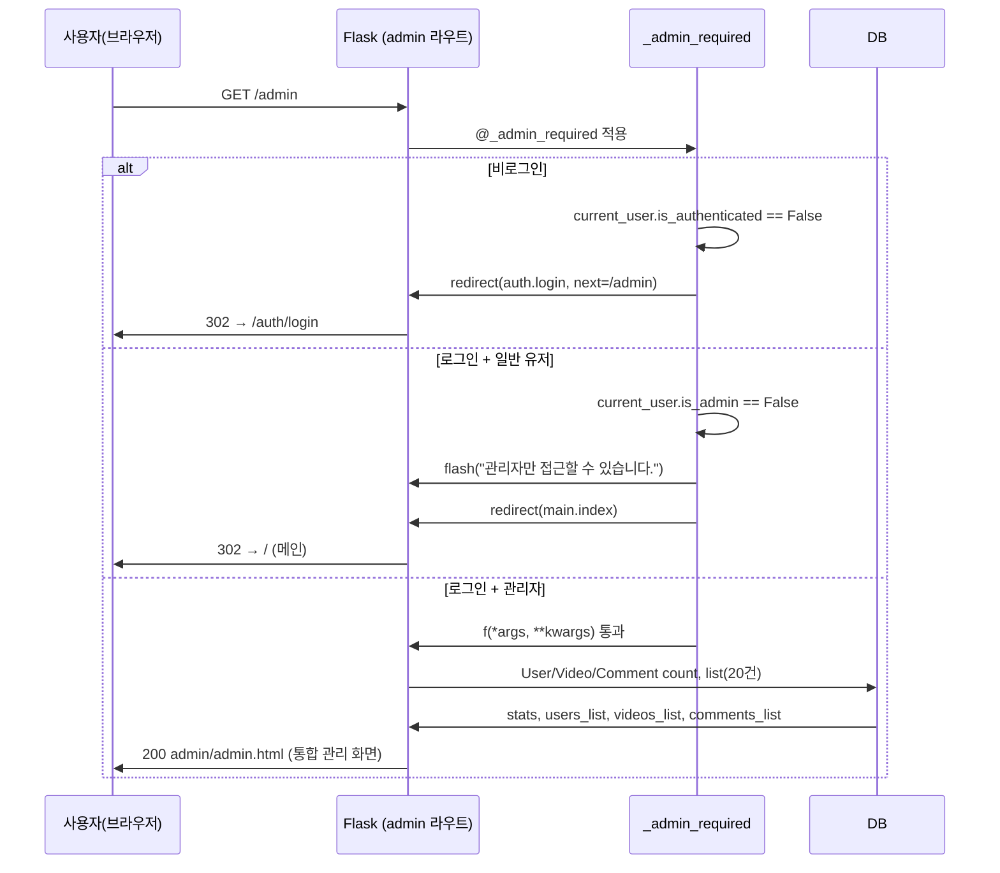
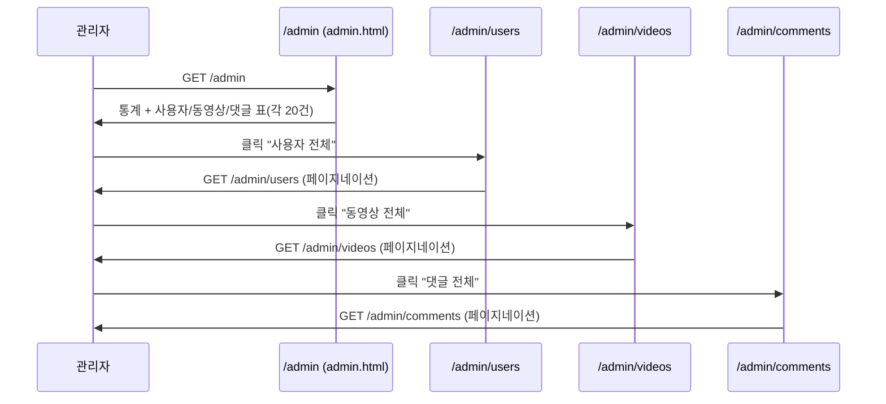
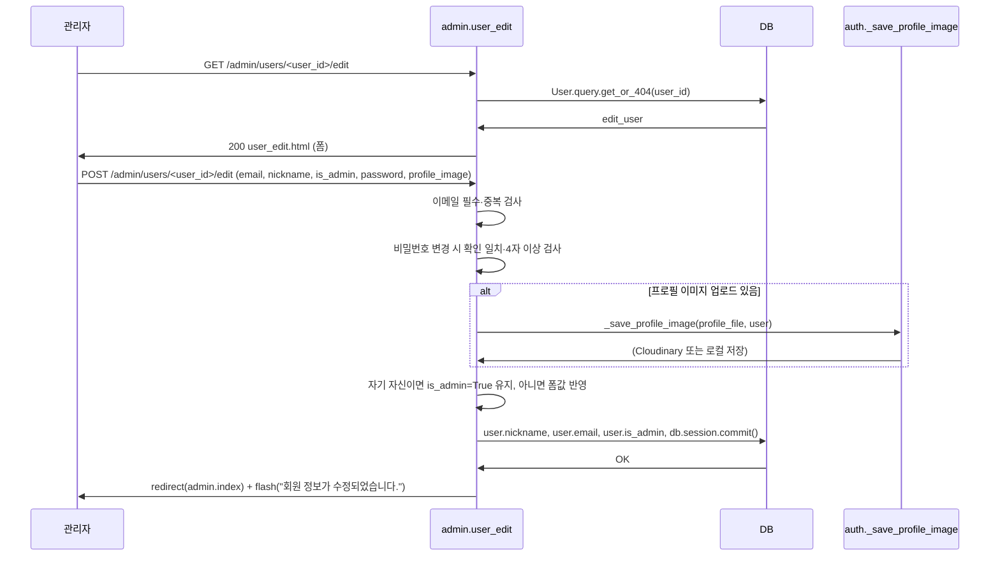
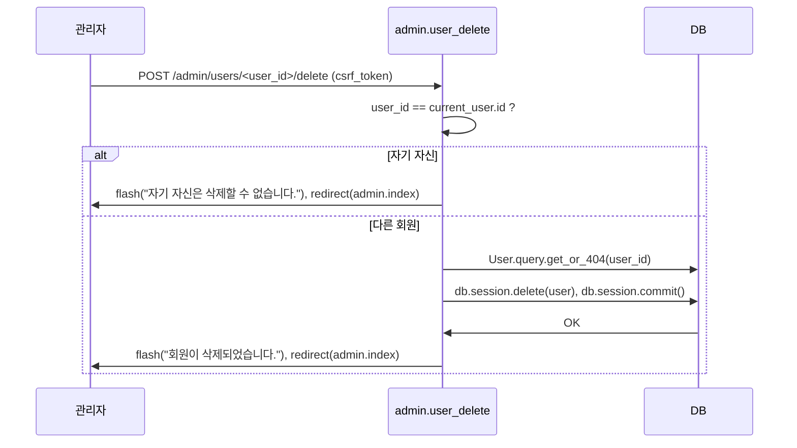
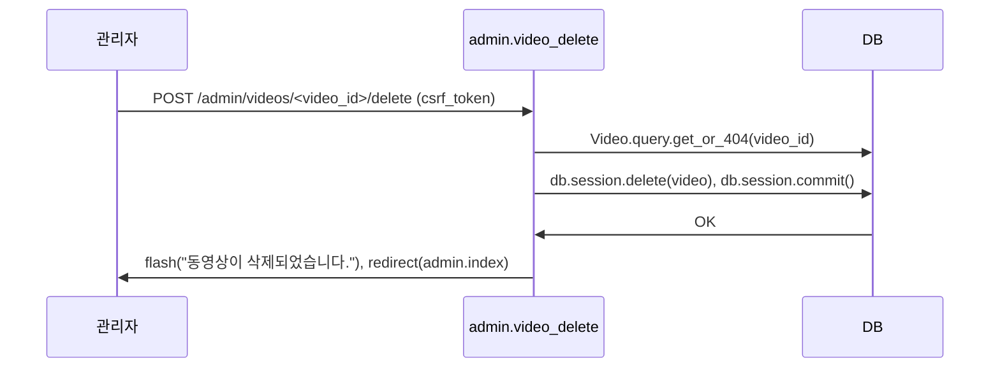
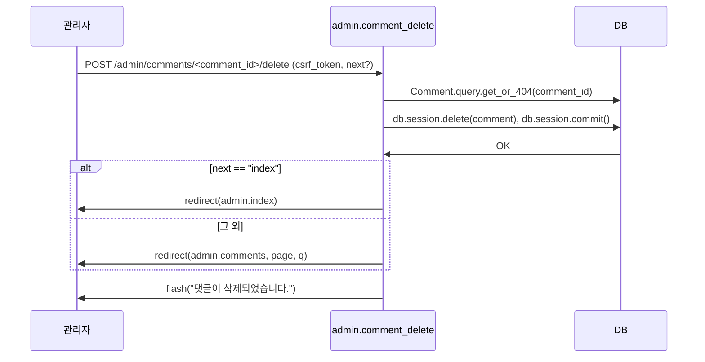
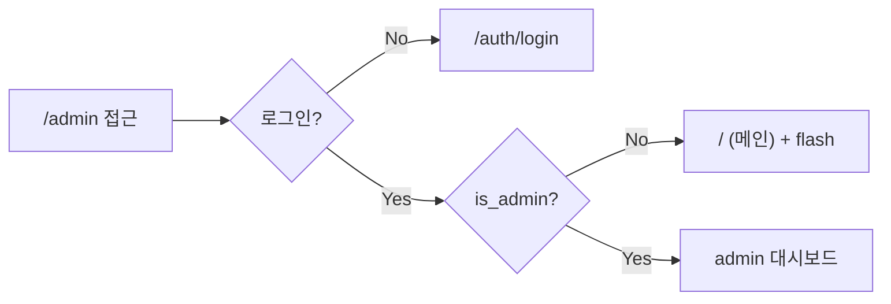

# 관리자 기능 시퀀스 (Mermaid)

WeTube 관리자(/admin) 접근·조회·수정·삭제 흐름을 시퀀스 다이어그램으로 정리합니다.

---

## 1. /admin 접근 시퀀스

사용자가 `/admin`에 접근할 때 인증·권한에 따른 분기입니다.

---

## 2. 관리자 대시보드 → 세부 목록 이동

통합 관리 화면에서 "전체 보기"로 사용자/동영상/댓글 목록 페이지로 이동하는 흐름입니다.

---

## 3. 회원 수정 시퀀스 (관리자)

관리자가 특정 회원의 정보(이메일, 닉네임, 비밀번호, 프로필 이미지, 관리자 여부)를 수정하는 흐름입니다.

---

## 4. 회원 삭제 시퀀스

관리자가 회원 삭제 버튼을 눌렀을 때의 흐름입니다. 자기 자신은 삭제할 수 없습니다.

---

## 5. 동영상 삭제 시퀀스

관리자가 동영상 삭제 버튼을 눌렀을 때의 흐름입니다.

---

## 6. 댓글 삭제 시퀀스

관리자가 댓글 삭제 버튼을 눌렀을 때의 흐름입니다. `next=index`이면 통합 관리 페이지로, 없으면 댓글 목록 페이지로 돌아갑니다.

---

## 7. 관리자 권한 판단 요약

---

## 8. 관련 라우트·역할

| 경로 | 메서드 | 설명 |
|------|--------|------|
| `/admin` | GET | 관리자 통합 대시보드 (통계 + 사용자/동영상/댓글 표) |
| `/admin/users` | GET | 회원 목록 (검색·페이지네이션) |
| `/admin/users/<id>/edit` | GET, POST | 회원 수정 (이메일, 닉네임, 비밀번호, 프로필, 관리자 여부) |
| `/admin/users/<id>/delete` | POST | 회원 삭제 (자기 자신 제외) |
| `/admin/videos` | GET | 동영상 목록 |
| `/admin/videos/<id>/delete` | POST | 동영상 삭제 |
| `/admin/comments` | GET | 댓글 목록 |
| `/admin/comments/<id>/delete` | POST | 댓글 삭제 |

모든 `/admin/*` 라우트는 `@login_required` + `@_admin_required` 로 보호됩니다.
